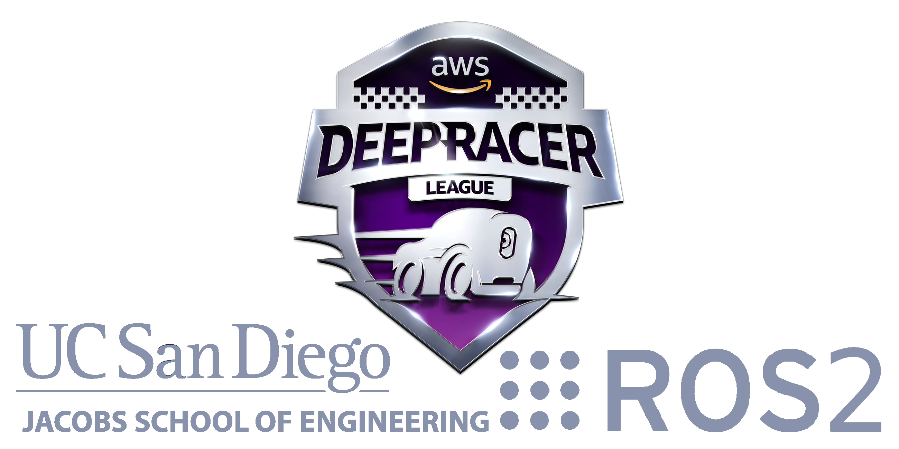

# **ucsd_robo_car_aws_deepracer_cosmos**

### A simple ROS2 package using OpenCV on aws deepracer rc car (with ackerman steering) with the developer in mind. This package provides the framework that allows the user to define their own controller algorithms and image processing techniques to navigate or do other interesting projects! 

#### AWS Deepracer ROS2 Demo

## **Table of Contents**

  - [**Environment Configuration**](#environment-configuration)
    - [Create a gitlab account](#1-create-a-gitlab-account)
    - [Access this repository](#2-access-this-repository)
    - [Enable X11 forwarding](#enable-x11-forwarding)
  - [**Work Flow To Use This Repository**](#work-flow-to-use-this-repository)
  - [**Nodes**](#nodes)
    - [deepracer_calibration_node](#deepracer_calibration_node)
    - [lane_detection_node](#lane_detection_node)
    - [lane_guidance_node](#lane_guidance_node)
  - [**Topics**](#topics)
    - [ctrl_pkg/servo_msg](#ctrl_pkg-servo_msg)
    - [camera_pkg/display_mjpeg](#camera_pkg-display_mjpeg)
    - [centroid](#centroid)
  - [**Launch**](#launch)
    - [aws_rosracer.launch](#aws_rosracerlaunch)
  - [**Example videos done with this package**](#example-videos-done-with-this-package)
    - [Example 1](#example-1)

## **Environment Configuration**

**NOTE: all text that are in boxes like `this` are to be entered into the _terminal window_**

#### **1. Create a gitlab account**

**NOTE: This step is optional/recommended**

  a. Follow steps found here <a href="https://about.gitlab.com/free-trial/" >here</a>

#### **2. Access this repository**

  **NOTE: (if step 1 was not completed, skip steps 2.a-c and choose option 2 under step 2d**

  **a. Generate an SSH key and provide it to Gitlab for access to repositories**

   `ssh-keygen # Use all defaults`

  **b. Then press enter until you get to an empty comand line, then**

   `cat $HOME/.ssh/id_rsa.pub`

  **c. Then copy the ssh key and go back to Gitlab. Click on your user profile at the top right corner of the screen then**
     
  **click on _preferences_ from the drop down menu. Now a new panel on the left hand side of the screen wil apear, click on _SSH Keys_,**
     
  **then paste your SSH key into the text field and submit it.**

  **d. Create ROS workspace and obtain copy of ucsd_robo_car_simple_ros repository**
   
   `cd`

   `mkdir projects && cd projects`

   `mkdir deepracer_ws && cd deepracer_ws`

   `mkdir src && cd src`

  **e. Clone this repository with either of the following options:**

   option 1
   `git clone git@gitlab.com:djnighti/ucsd_robo_car_aws_deepracer_cosmos.git`

   or (if you have not setup your own gitlab account and an ssh key)

   option 2
   `git clone https://gitlab.com/djnighti/ucsd_robo_car_aws_deepracer_cosmos.git`

  **f. Add some lines of code to the bash script so that every time a new terminal is opened, root user is activated, builds this ROS2 package and sources all the correct ROS2 setups/variables and the pre-built deepracer ROS2 library**

  First for the **deepracer** user bashrc, enter the following into the terminal:
   
   `nano ~/.bashrc`
  
  add the following line of code at the end of the bash script as the **deepracer** user

   `sudo su`

  Then press 
   
   **ctrl-x** 
   
   Then press 
   
   **y**  (yes) 
   
   and then press 
   
   **enter** 
   
   to save an quit

  Now open a new terminal or restart current terminal

  Now the **root** user bashrc, enter the following into the terminal:

   `cd`

   `nano ~/.bashrc`

   add the following lines of code at the end of the bash script as the **root** user

   `cd`

   `xauth merge /home/deepracer/.Xauthority` (This is for ssh tunneling cv2 windows)

   `source /opt/ros/foxy/setup.bash`

   `source /opt/intel/openvino_2021/bin/setupvars.sh`

   `cd /home/deepracer/projects/deepracer_ws`

   `colcon build`

   `source install/setup.bash`

   `source /opt/aws/deepracer/lib/setup.bash`

   Then press 
   
   **ctrl-x** 
   
   Then press 
   
   **y**  (yes) 
   
   and then press 
   
   **enter** 
   
   to save an quit

  Now open a new terminal or restart current terminal to begin! Proceed to the following section to see the [**Work Flow To Use This Repository**](#work-flow-to-use-this-repository)

  **i. (ONLY DO THIS AS NEEDED) Now as this remote repository is updated, enter the following commands to update the local repository on the deepracer:**
   
   `cd`

   `cd projects/deepracer_ws/src/ucsd_robo_car_aws_deepracer_cosmos`
   
   `git stash`

   `git pull`

   `chmod -R 777 .`

## **Enable X11 forwarding**

Associated file: **x11_forwarding_steps.txt**

Some deepracers did not have this enabled, so if needed please read the steps in this file to setup X11 forwarding

## **Work Flow To Use This Repository**

  **NOTE: To exit any of the programs, in the terminal press the following 2 keys:**

  **ctrl-c**

1. Design a custom controller algorithm and implement any image processing techniques by using the [**deepracer_calibration_node**](#deepracer_calibration_node). This node will help define control/image parameters by using cv sliders. Add as many sliders as the window will allow! The most currently tested implemented at once was **18 sliders!**

`ros2 run ucsd_robo_car_aws_deepracer_cosmos deepracer_calibration_node`

2. Edit [**lane_detection_node**](#lane_detection_node) and [**lane_guidance_node**](#lane_guidance_node) respectively based on the controller defined in [**deepracer_calibration_node**](#deepracer_calibration_node) so the deepracer will behave the same way in autonomous mode.

3. Launch the aws rosracer, which will launch the autonomous mode of the controller created in [**deepracer_calibration_node**](#deepracer_calibration_node).

`ros2 launch ucsd_robo_car_aws_deepracer_cosmos aws_rosracer.launch.py`

4. Tune parameters in step 1 until desired behvior is achieved

## **Nodes**

#### **deepracer_calibration_node**

Associated file: **deepracer_calibration_node.py**

Example sliders are created to illustrate their usage throughout this node. Create your own parameters that will help the deepracer achieve whatever goal it is trying to accomplish! The controller in this node should match the controller in [**lane_detection_node**](#lane_detection_node) (functionality, not neccessarily syntax because of usage) to make sure the car will behave the same way it did during the calibration done in [deepracer_calibration_node](#deepracer_calibration_node).

Calibrate the camera, throttle and steering by creating/using the sliders to determine whatever parameters are needed to define your custom controller. Some examples include:
- the right color filter 
- region of interest
- desired image dimmensions
- throttle values for both the optimal condtion (error = 0) and the non optimal condtion (error !=0) AKA go fast when error=0 and go slow if error !=0
- steering sensitivty change the Kp value to adjust the steering sensitivty (as Kp --> 1 steering more responsive, as Kp --> 0  steering less responsive) 

These values are saved automatically to a configuration file, so just press control-c when the deepracer is calibrated. Below is the command to begin the calibration process.

`ros2 run ucsd_robo_car_aws_deepracer deepracer_calibration_node`

#### **lane_detection_node**

Associated file: **lane_detection.py**

This node subscribes from [**camera_pkg/display_mjpeg**](#camera_pkg/display_mjpeg) topic and is left EMPTY for the user to implement their own opencv functions. This node currently needs to publish an error value to the [**centroid**](#centroid) topic between the target steering value and the current steering value (both undefined). However, this is just a simple template and can be altered to for other functionality.

#### **lane_guidance_node**

Associated file: lane_guidance.py

This node subscribes to the [**centroid**](#centroid) topic, calculates the throttle and steering
based on the error value, and then publishes them to the [**ctrl_pkg/servo_msg**](#ctrl_pkg-servo_msg) topic.

The throttle is based on an error threshold defined in the init function ie. car goes faster when error is below threshold and slows down when the error is above the specified threshold.

Steering is based on a proportional controller implemented by using the error found by the [**lane_detection_node**](#lane_detection_node).

**NOTE: The current controller in this node is just a _template_ and is meant to be changed/upgraded!**

## **Topics**

#### **ctrl_pkg / servo_msg**
| Name       | Msg Type              | Info                                                       |
| ---------- | --------------------- | ---------------------------------------------------------- |
| /ctrl_pkg/servo_msg   | deepracer_interfaces_pkg.msg.ServoCtrlMsg  | Two Float values each from -1 to 1 for controlling throttle and steering | 

Useful command to stop vehicle:

`ros2 topic pub ctrl_pkg/servo_msg deepracer_interfaces_pkg/msg/ServoCtrlMsg "{angle: 0.0, throttle: 0.0}"`

#### **camera_pkg / display_mjpeg**
| Name       | Msg Type              | Info                                                       |
| ---------- | --------------------- | ---------------------------------------------------------- |
| /camera_pkg/display_mjpeg | sensor_msgs.msg.Image | Image last read from USB camera image                      |

Useful command to troubleshoot camera:

`ros2 topic echo /camera_pkg/display_mjpeg`

#### **centroid**
| Name       | Msg Type              | Info                                                       |
| ---------- | --------------------- | ---------------------------------------------------------- |
| /centroid   | std_msgs.msg.Float32    | Float value for that represents the error of the x coordinate of centroid in camera image space |

Useful command to troublshoot image processing:

`ros2 topic echo /centroid`

## **Launch**

#### **aws_rosracer.launch**

Associated file: aws_rosracer.launch.py

This file will launch [**lane_detection_node**](#lane_detection_node) and [**lane_guidance_node**](#lane_guidance_node) as well as load all the ROS-parameters selected in [deepracer_calibration_node](#deepracer_calibration_node)

**Before launching, please calibrate the robot first while on the stand! See** [deepracer_calibration_node](#deepracer_calibration_node)

`ros2 launch ucsd_robo_car_aws_deepracer_cosmos aws_rosracer.launch.py`

## **Example videos done with this package** 

#### Example 1

